# FitMate - 모바일 앱

운동 메이트를 찾을 수 있는 소셜 플랫폼의 모바일 애플리케이션입니다.

백엔드부터 모바일 앱, 스토어 배포까지 1인 풀스택으로 수행한 프로젝트입니다.

> **백엔드 저장소** : [fitmate-back](https://github.com/mirea70/fitmate-back)


## 기술 스택

| 구분 | 기술 |
|------|------|
| **Framework** | Flutter 3.x |
| **Language** | Dart |
| **상태 관리** | Riverpod |
| **인증** | Firebase Phone Auth, Kakao OAuth |
| **실시간 통신** | STOMP (WebSocket + SockJS) |
| **장소 검색** | Naver Search API |
| **로컬 저장소** | Flutter Secure Storage |
| **배포** | Google Play Store |


## 주요 기능

| 기능 | 설명 |
|------|------|
| **메이트 모집** | 운동 종목별 메이트 모집 등록 (선착순/승인제, 참가비, 연령/성별 제한) |
| **검색/필터** | 종목, 지역, 날짜, 인원 등 동적 조건별 검색 및 필터링 |
| **실시간 채팅** | STOMP 기반 그룹/1:1 실시간 채팅 |
| **소셜 로그인** | 카카오 로그인 + 일반 회원가입 |
| **SMS 인증** | Firebase Phone Auth 기반 휴대전화 인증 |
| **프로필** | 프로필 관리, 팔로우/팔로워, 찜 목록 |
| **알림** | 모집 승인/마감/신청 등 실시간 알림 |


## 프로젝트 구조

```
lib/
├── config/          # 앱 설정 (AppConfig, Dio, STOMP, Firebase 등)
├── model/           # 데이터 모델 (Mate, Account, Chat 등)
├── repository/      # API 통신 레이어
├── view/            # 화면 (UI)
│   ├── account/     # 로그인, 회원가입, 프로필
│   ├── mate/        # 메이트 목록, 등록, 상세, 검색
│   └── chat/        # 채팅 목록, 채팅방
├── view_model/      # 상태 관리 (Riverpod)
├── widget/          # 공용 위젯
└── service/         # Firebase Phone Auth 등 서비스
```


## 주요 화면

### 홈 / 메이트 목록 / 필터
| 홈 | 메이트 목록 | 필터 |
|:---:|:---:|:---:|
|  | 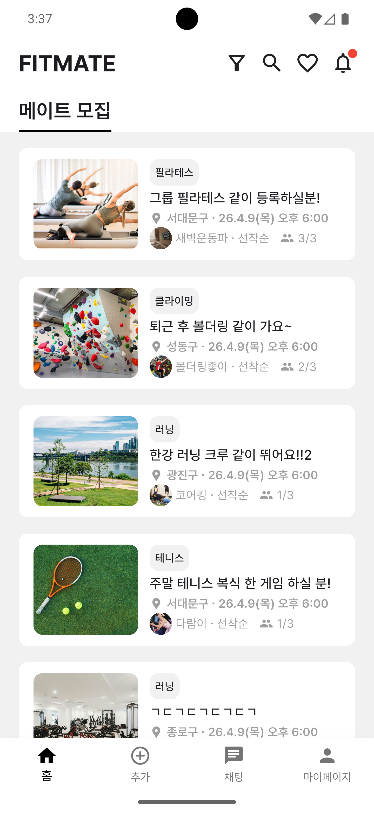 | 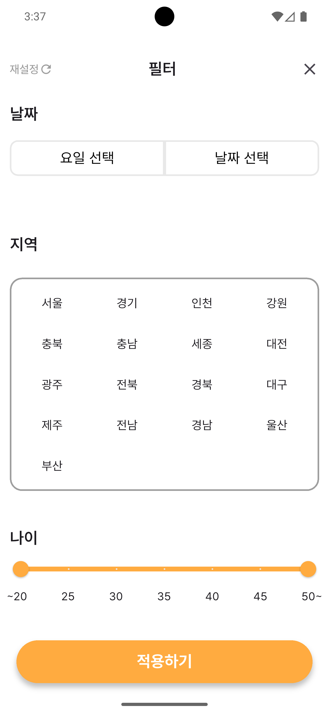 |

### 메이트 상세 / 참여 신청
| 메이트 상세 | 참여 가이드 | 참여 질문 답변 |
|:---:|:---:|:---:|
| 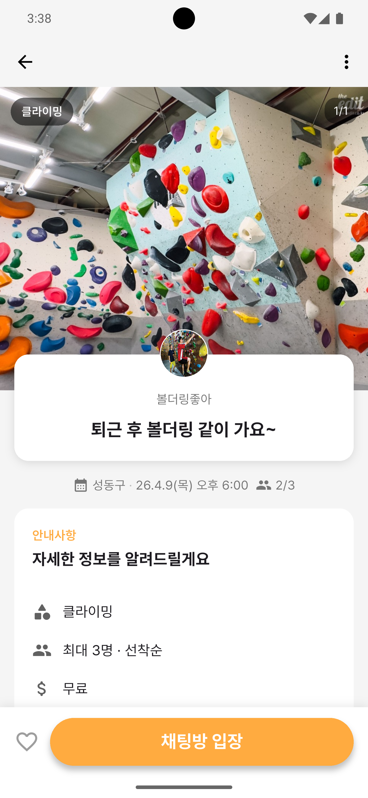 | 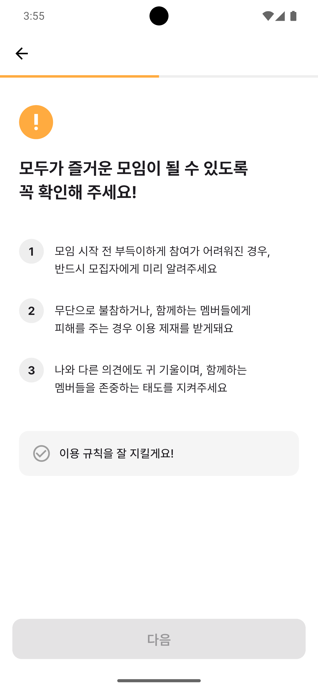 | 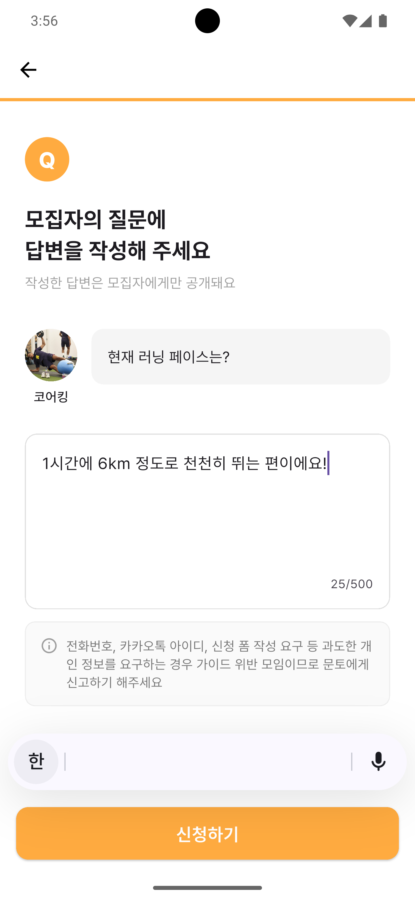 |

### 메이트 등록 (7단계)
| 1. 카테고리 선택 | 2. 장소 검색 | 3. 장소 선택 |
|:---:|:---:|:---:|
| 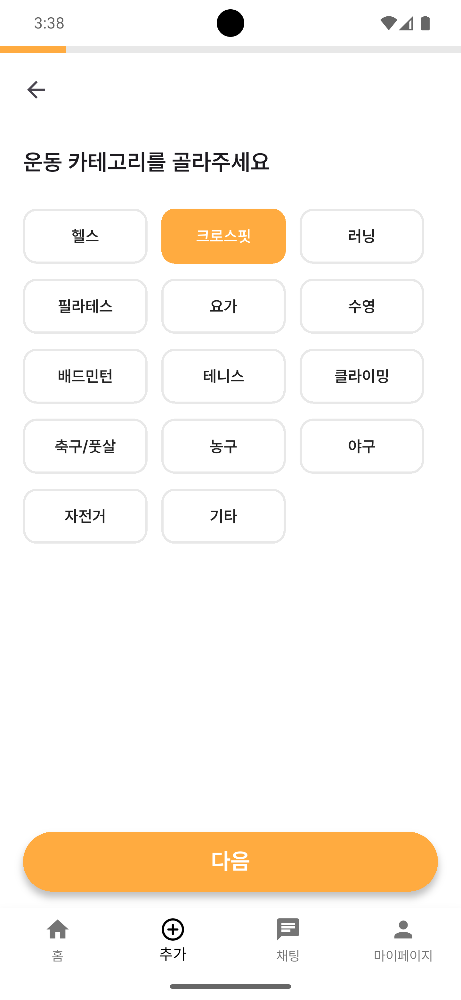 | 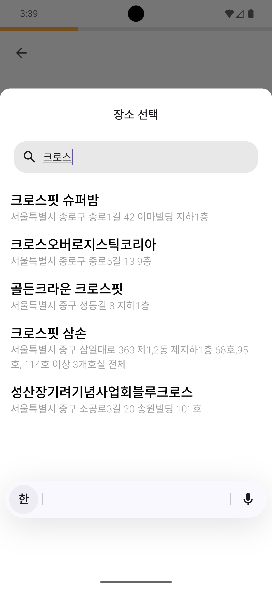 | 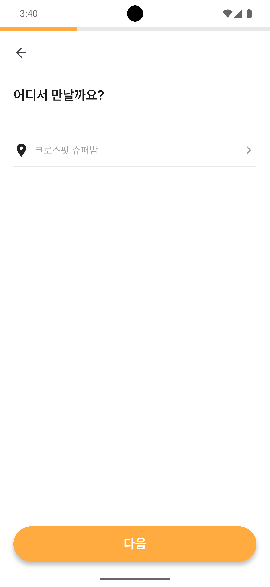 |

| 4. 소개 작성 | 5. 일시 선택 | 6. 캘린더/시간 |
|:---:|:---:|:---:|
| 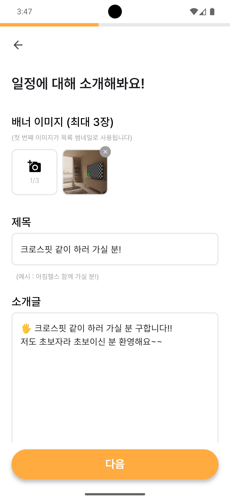 | 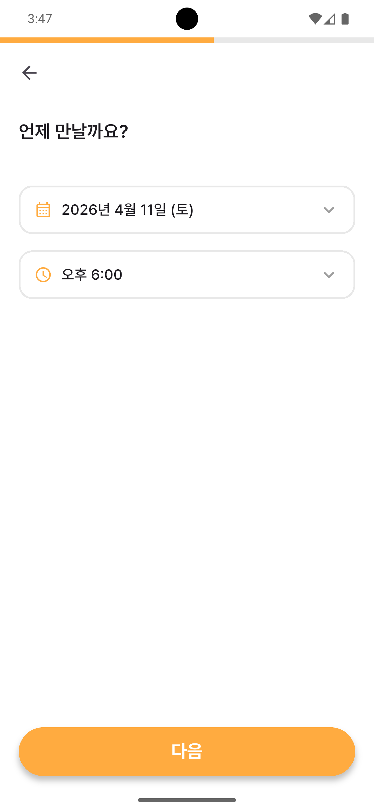 | 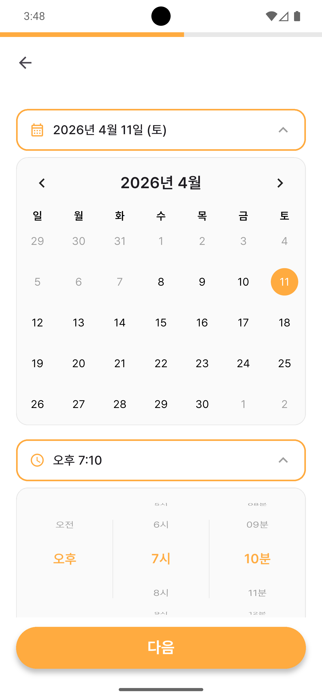 |

| 7. 참가비 | 8. 모집 규칙 | 9. 모집 방식 |
|:---:|:---:|:---:|
| 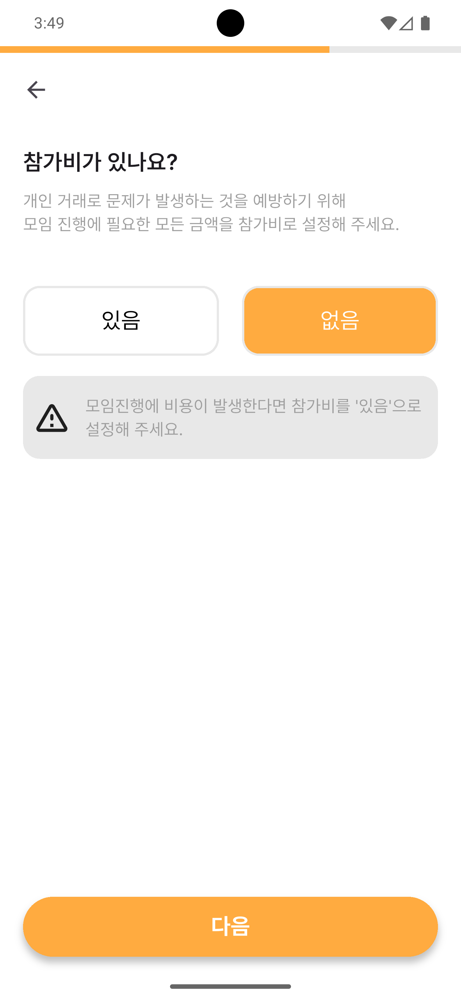 | 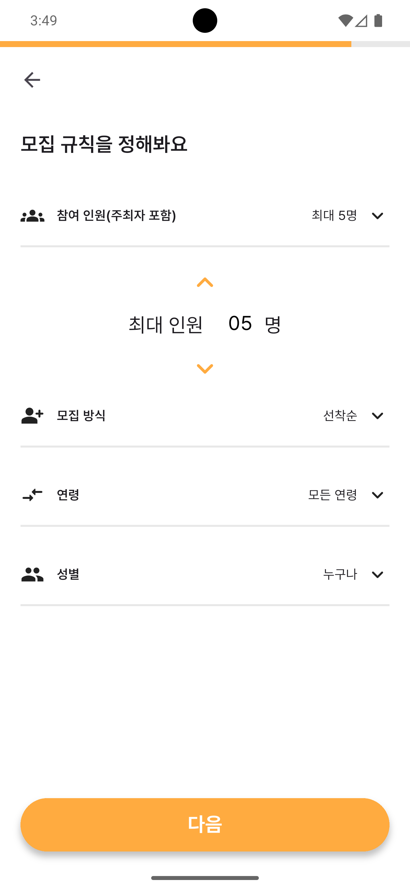 | 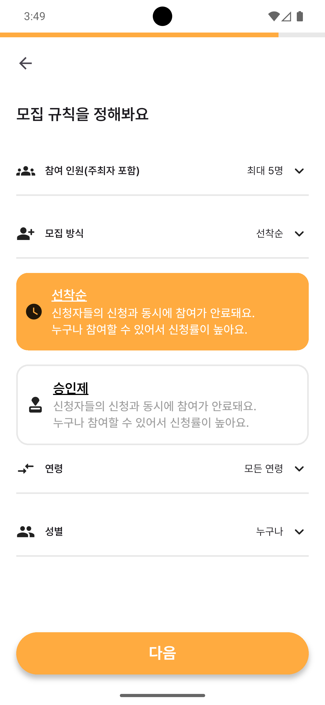 |

| 10. 연령 설정 | 11. 성별 설정 | 12. 참여 질문 |
|:---:|:---:|:---:|
| 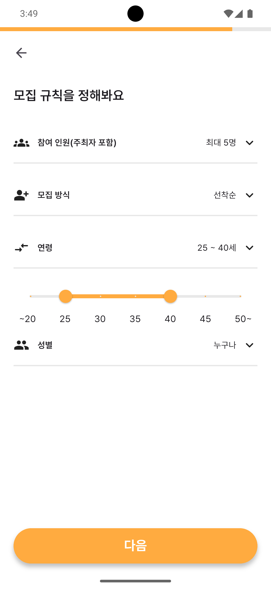 | 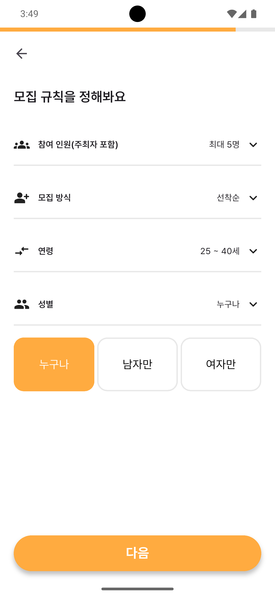 | 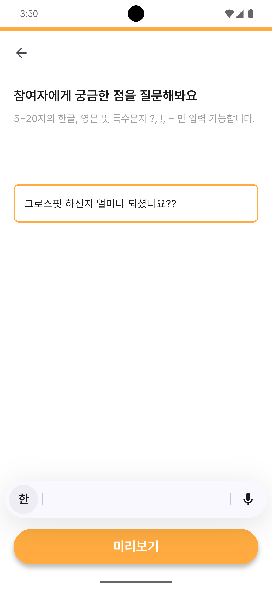 |

| 13. 미리보기 |
|:---:|
| 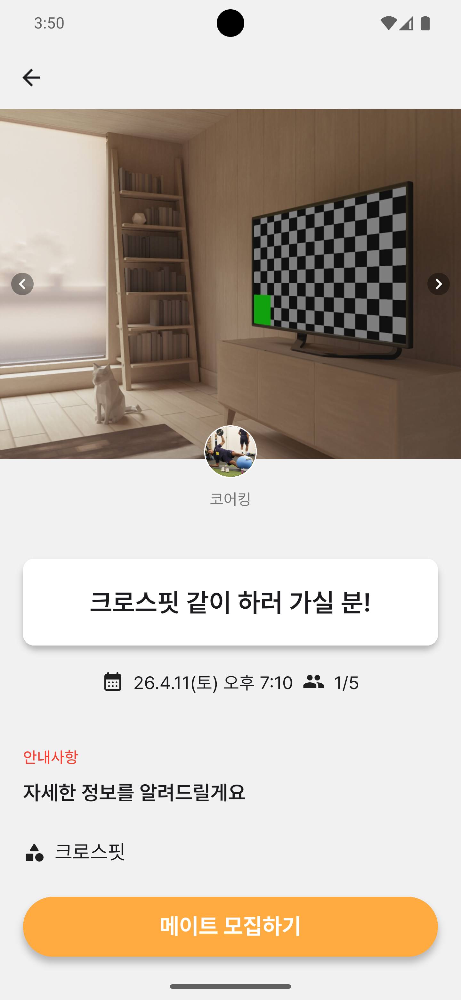 |

### 채팅
| 채팅 목록 | 채팅방 | 채팅 멤버 |
|:---:|:---:|:---:|
|  | 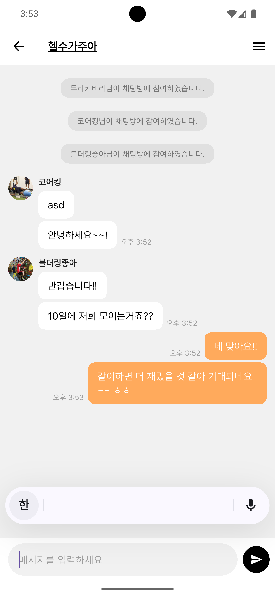 | 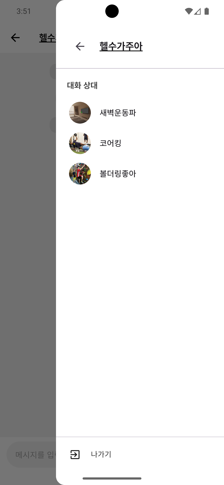 |

### 마이페이지
| 마이페이지 |
|:---:|
| 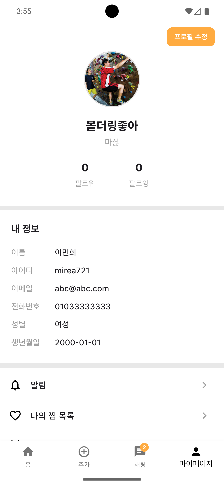 |


## 실행 방법

### 사전 준비

- Flutter SDK 3.x 이상
- Android Studio 또는 VS Code
- 백엔드 서버 실행 ([fitmate-back](https://github.com/mirea70/fitmate-back))

### 환경 변수 설정

`.env.dev` 파일 생성:
```
ENV=dev
KAKAO_NATIVE_APP_KEY=<your_kakao_native_app_key>
NAVER_CLIENT_ID=<your_naver_client_id>
NAVER_CLIENT_SECRET=<your_naver_client_secret>
IS_EMULATOR=false
```

### 빌드 및 실행

```bash
# 의존성 설치
flutter pub get

# 개발 모드 실행 (실제 기기)
flutter run --dart-define-from-file=.env.dev

# 에뮬레이터 실행 (IS_EMULATOR=true로 변경 후)
flutter run --dart-define-from-file=.env.emulator

# 릴리즈 빌드 (프로덕션)
flutter build appbundle --release --dart-define-from-file=.env.prod
```


## 아키텍처

```
View (UI)
  ↓ watch/read
ViewModel (Riverpod Notifier/Provider)
  ↓ 호출
Repository (Dio HTTP / STOMP)
  ↓ 통신
Backend API (Spring Boot)
```

- **View** : 화면 렌더링, 사용자 입력 처리
- **ViewModel** : Riverpod 기반 상태 관리, 비즈니스 로직
- **Repository** : 서버 API 통신, 인터페이스 분리 (테스트 용이)
- **Service** : Firebase, 이미지 캐시 등 외부 서비스 래핑


## 배포

- **Google Play Store** 비공개 테스트 배포 완료
- 릴리즈 서명, 앱 아이콘, 스토어 등록정보, 개인정보처리방침 등 스토어 등록 전 과정 수행
- 프로덕션 배포 준비 중
